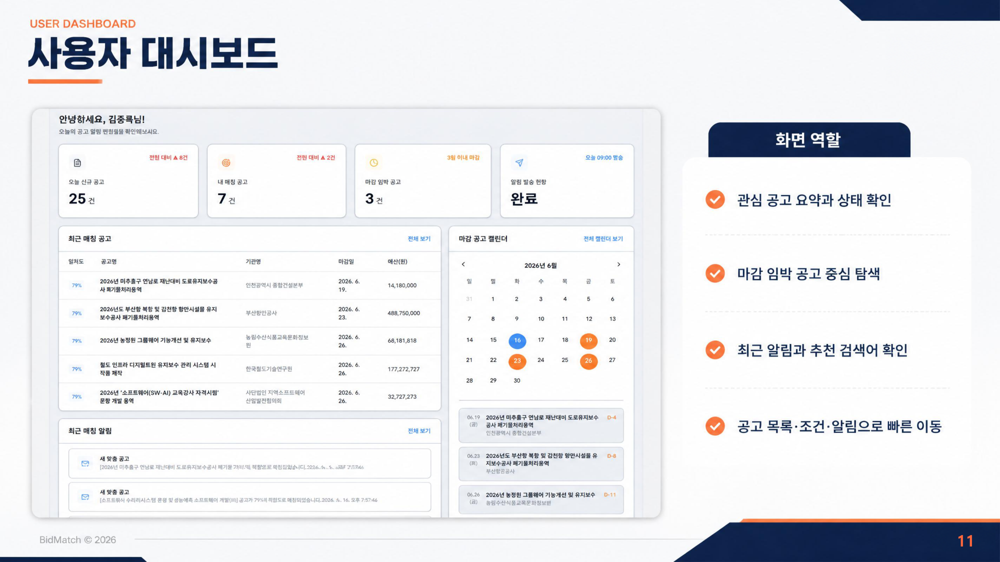

<div align="center">
  
</div>

# BidMatch 

> **입찰 담당자를 위한 나라장터 맞춤 공고 자동 수집 및 이메일 알림 B2B SaaS**

<div align="center">
  <video src="./assets/videos/demo_video.mp4" controls="controls" width="80%" autoplay loop muted>
    영상이 지원되지 않는 브라우저입니다.
  </video>
  <br/>
  <em>▶️ BidMatch 핵심 기능 시연 영상</em>
</div>

BidMatch는 매일 반복되는 공고 검색의 부담, 복잡한 조건 관리, 운영 관리의 부재라는 3가지 핵심 문제를 **자동화**와 **조건 매칭**으로 해결하기 위해 탄생한 서비스입니다. 나라장터 맞춤 공고 알림 서비스로, 공공입찰 공고 수집부터 조건 매칭, 이메일 알림, 운영 관리까지 연결하는 업무용 웹 애플리케이션입니다.

---

## 🚀 핵심 경쟁력: 완벽한 자동화 파이프라인 & AI 연동

BidMatch는 단순한 공고 게시판을 넘어, **업무의 시작과 끝을 책임지는 자동화 플랫폼**입니다.

1. **End-to-End 자동화 파이프라인**: 
   매일 정해진 시간에 스케줄러가 나라장터 API를 호출하여 공고를 수집하고(Raw → 정규화), 사용자가 설정한 복잡한 조건(키워드, 지역, 업종)과 매칭한 뒤, 중복 발송을 방지하여 이메일 다이제스트 형태로 전송하는 모든 과정이 사람의 개입 없이 매끄럽게(Seamless) 진행됩니다.
2. **AI 연동 (Gemini API)**: 
   방대하고 복잡한 공고 원문을 일일이 읽을 필요 없이, Gemini API를 통해 공고의 핵심 내용만 3줄로 요약하여 제공합니다. 이를 통해 입찰 담당자의 업무 효율을 극대화합니다.

<div align="center">
  
</div>

---

## ✨ 주요 기능 (Key Features)

- **📥 공고 자동 수집**: 조달청 나라장터 공공 API를 연동하여 매일 입찰 공고를 자동 수집합니다. (지연 방지를 위한 재시도 로직 포함)
- **🎯 맞춤 조건 매칭**: 사용자가 설정한 키워드(포함/제외), 지역, 업종, 기관, 기업 조건에 맞춰 공고를 꼼꼼하게 선별합니다.
- **📧 이메일 다이제스트 알림**: 매칭된 관심 공고를 요약하여 Gmail SMTP 기반 HTML 이메일로 자동 발송합니다.
- **📊 스마트 대시보드 & 캘린더**: 최근 매칭 공고, 마감 임박 공고 캘린더 뷰를 제공하여 시각적으로 일정을 관리할 수 있습니다.
- **⚙️ 통합 관리자 기능**: 기업 검증(승인/반려), 수집 및 이메일 발송 로그 모니터링을 지원합니다.

<div align="center">
  
</div>

---

## 🛠 기술 스택 (Tech Stack)

### Frontend
- **React 18.3.1**, **Vite 5.4.11**, JavaScript JSX

### Backend
- **Python 3.12**, **Flask**, Flask-CORS
- **APScheduler** (자동화 배치 스케줄링)

### Database
- **MariaDB**, **PyMySQL**

### External APIs
- **공공 API**: 조달청 나라장터 데이터 조회
- **Kakao / Google API**: OAuth 기반 소셜 로그인 기능
- **Gemini API**: AI 기반 공고 정보 3줄 요약

### 배포 (Deployment)
- **Cloudtype**

---

## 🏗 시스템 아키텍처 (Architecture)

프론트엔드와 백엔드가 분리된 구조로, 중앙의 MariaDB를 중심으로 사용자 화면과 운영 배치 작업이 연결되어 있습니다.

<div align="center">
  
</div>

- **사용자 인터페이스**: React Frontend
- **API 서버**: Flask API Server (JWT 인증)
- **배치 자동화**: APScheduler(수집) → Matcher(매칭) → Email Sender(발송)

---

## 📂 프로젝트 구조 (Directory Structure)

```text
BidMatch/
├── back-end/               # Flask API 및 배치 스케줄러 (Python)
│   ├── api/                # API 라우터 (RESTful API)
│   ├── core/               # 데이터베이스 연결 및 설정
│   ├── jobs/               # APScheduler 기반 배치 작업 (수집, 매칭, 발송)
│   ├── repositories/       # DB 접근 및 쿼리 처리
│   ├── services/           # 비즈니스 로직 (매칭, 이메일, AI 요약)
│   └── requirements.txt    # 백엔드 의존성
├── front-end/              # React 웹 애플리케이션 (Vite)
│   ├── src/
│   │   ├── components/     # 재사용 가능한 UI 컴포넌트
│   │   ├── pages/          # 대시보드, 공고 목록 등 화면 페이지
│   │   ├── services/       # 백엔드 API 연동
│   │   └── styles/         # CSS 스타일링
│   └── package.json        # 프론트엔드 의존성
└── document/               # 프로젝트 기획, 설계, ERD, 정책 문서
```

---

## 🚀 시작하기 (Getting Started)

### 0. 사전 요구 사항 (Prerequisites)
- **Node.js**: v20.19.x LTS 이상 (권장)
- **Python**: v3.12 이상
- **Database**: MariaDB 10.x 이상

### 1. 환경 변수 설정 (Environment Variables)

프로젝트 실행 전, 프론트엔드와 백엔드 각각에 `.env` 파일을 구성해야 합니다. (`.env.example` 파일 참조)

**프론트엔드 (`front-end/.env`)**
```bash
cd front-end
cp .env.example .env
```
- `VITE_API_BASE_URL` 설정 확인 (기본값: http://localhost:5000)

**백엔드 (`back-end/.env`)**
```bash
cd back-end
cp .env.example .env
```
- **DB 설정**: `DB_HOST`, `DB_USER`, `DB_PASSWORD`, `DB_NAME` 등 로컬 MariaDB 환경에 맞게 입력합니다.
- **공공 API 설정**: 조달청 나라장터 데이터를 수집하기 위해 발급받은 `G2B_API_KEY`를 입력합니다.
- **이메일(SMTP) 설정**: 이메일 발송을 위해 Gmail 계정과 발급받은 '16자리 앱 비밀번호'를 `SMTP_USER`와 `SMTP_PASSWORD`에 입력합니다.
- **AI 요약 설정**: 공고 요약 기능을 위해 발급받은 Google Gemini API Key를 입력합니다.

### 2. 프론트엔드 실행 (React)
```bash
cd front-end
npm install
npm run dev
```

### 3. 백엔드 실행 (Flask)
```bash
cd back-end
python -m venv venv
# Windows: venv\Scripts\activate
# Mac/Linux: source venv/bin/activate
pip install -r requirements.txt
python app.py
```

---

## 👨‍💻 팀 구성 및 역할 (Team)

BidMatch는 5명의 팀원이 각자의 전문 분야를 맡아 성공적으로 구축되었습니다.

| 이름 | 역할 | 담당 내용 |
| :--- | :--- | :--- |
| **안민영** | PM | 시스템 설계 및 프로젝트 관리, 일정/범위/구조 조율, 산출물 정리 |
| **김종록** | PL | 소셜 로그인, 이메일 발송 파이프라인, LLM(Gemini) 인증 및 요약 핵심 로직 |
| **김혜라** | 팀원 | 사용자 대시보드, 공고 목록/통계/탐색 화면 UI/UX 구성 |
| **변영진** | 팀원 | 데이터 수집 API 연동, 나라장터 공공 API 수집 및 데이터 연동 파이프라인 |
| **이명일** | 팀원 | 캘린더 기반 마감 관리, 공고 상세 화면 및 사용자 관리 로직 |

---
*BidMatch © 2026*
